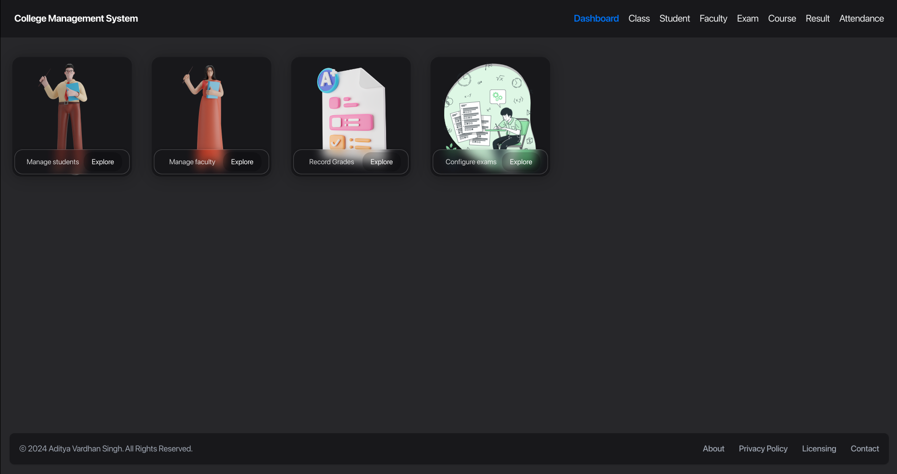

# College Management System

A streamlined solution for managing college operations efficiently. Our web app simplifies tasks like student enrollment, attendance tracking, course management, and result processing. With an intuitive interface and real-time updates, it ensures smooth coordination between administrators, faculty, and students.

# Preview (Screenshots)

### Dashboard

### Student

Student's list/table:

Add student form:

View student details:

Update student details:

Delete student details:

### Attendance

Attendance records/list/table

Mark attendance:

### Class

Class records/list/table

### Faculty

Faculty records:

Adding a new faculty:

### Course

